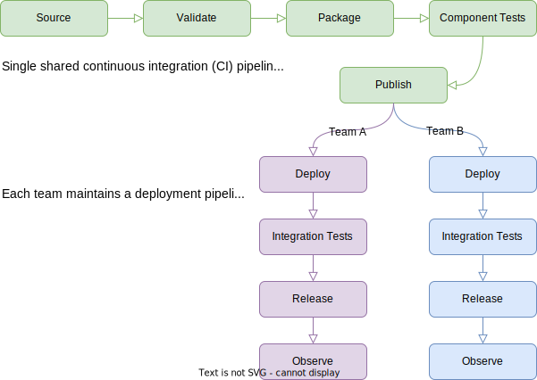

# SDLC Patterns

The process by which you make and release a change to your application is your **Software Development Lifecycle** or SDLC. Within `Flutter-Global` several SDLC patterns are widely used and directly supported by tools such as the [`git flutter` CLI](/git-flutter/). Using these standard SDLC patterns is recommended unless you have unusual requirements.

## Access & Branching

Your source code is stored in a repository within the `Flutter-Global` organisation. The standard branching patterns are:





Each pattern documents a default inner source contributor setup: `Internal` repository visibility with all members of `Flutter-Global` treated as contributors. This can be customised to use:

**Requested Access** requires you to maintain your own access request process. This can be effective when coupled with an automated team maintenance process or small contributor group. You will use [Codebase Governor] to configure contributor access for your custom contributor team instead of the `all-flutter-global` team.

**Closed Source** requires the repository to be switched to `Private` visibility to prevent any default read access. This is for sensitive content only. To change repository visibility you will need to contact the [Inner Source Team](/community/). This access model usually also requires use of your own requested access process.

## Inner Source CI



An inner source application will typically have a single shared codebase and several deployments. A change will follow these steps to production:

1. **Source**: A code edit is applied to a `Flutter-Global` repository with access controls and a branching strategy: [audited source](/sdlc/audited/), [reviewed source](/sdlc/reviewed/) or [multiple teams source](/sdlc/multiple-teams/).
2. **Validate**: Check proposed code changes by running a series of tests that must pass: [use GitHub Actions for this](/sdlc/validate/).
3. **Package**: Resolve any external dependencies to build a new version of the desired deployment package(s) e.g. binaries, docker, rpm, jar. You might need [self-hosted runners](/sdlc/validate/#self-hosted-runners) if a build requires internal network access.
4. **Component Tests**: Run available tests against the candidate deployment package with other dependent mocked packages: [see this description of test types](/sdlc/test/).
5. **Publish**: Publish the tested deployment package [to a registry](/sdlc/package/) so it is available to all who deploy it.
6. **Deploy**: Configure the package and deploy it to a specific topology (e.g. AWS, on-prem VM, k8s).
7. **Integration Tests**: Run available integration and non-functional checks.
8. **Release**: Promote the deployment through the required environments to rollout to production traffic.
9. **Observe**: Observe the release with heightened operational awareness to confirm success, with rollback invoked on suspicion of failure.

The standard SDLCs patterns documented cover steps (1)-(5). For an inner source application step (6) onwards is regarded as team/division specific and dependent on local requirements.
