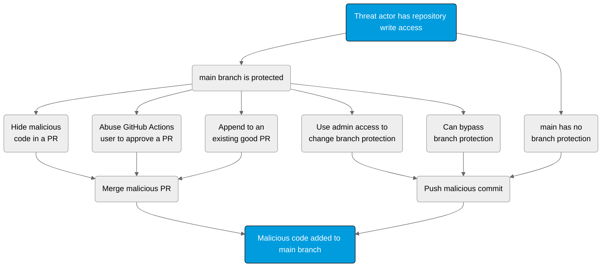

Just a place to store the mermaid content for threat models.

```mermaid
%%{init:{'theme':'neutral'}}%%

flowchart TD
    classDef hl stroke:#000,fill:#009CDE,color:white

    reality(Threat actor has repository write access)
    bp(main branch is protected)
    no_bp(main has no<br/>branch protection)
    change_bp(Use admin access to<br/>change branch protection)
    success(Malicious code added to main branch)
    hide(Hide malicious<br/>code in a PR)
    actions(Abuse GitHub Actions<br/>user to approve a PR)
    pr(Merge malicious PR)
    commit(Push malicious commit)
    append(Append to an<br/>existing good PR)
    bypass(Can bypass<br/>branch protection)

    reality:::hl --> bp
    bp --> hide
    hide --> pr
    bp --> actions
    actions --> pr
    bp --> append
    append --> pr
    pr --> success
    bp --> change_bp
    change_bp --> commit
    bp --> bypass
    bypass --> commit
    reality --> no_bp
    no_bp --> commit
    commit --> success:::hl
```

